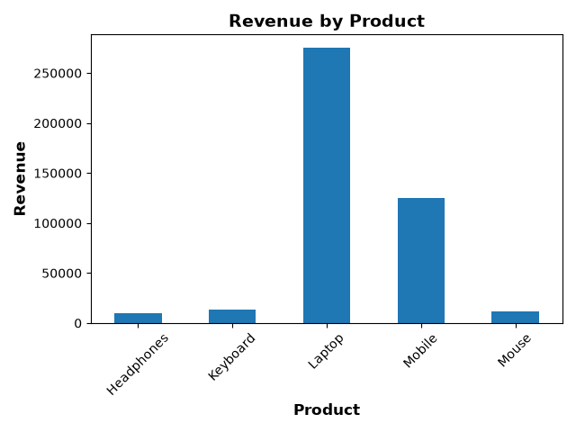

## 🛒 E-commerce Sales Dashboard

A beginner-friendly **E-commerce Sales Data Analysis project** built using **Python, Pandas, and Matplotlib**.

This project analyzes e-commerce sales data to understand revenue, product performance, category performance, regional sales, and monthly sales trends.

## 📌 Project Overview

The project uses a CSV dataset containing information about:

* Order ID
* Date
* Product
* Category
* Quantity
* Price
* Region

The data is analyzed using **Pandas**, and the results can be visualized using **Matplotlib**.

## 📂 Project Structure

```text
ecommerce-sales-dashboard/
│
├── ecommerce_analysis.py
├── sales.csv
└── README.md
```

## 🔍 Features

* 📊 Analyze total sales
* 💰 Calculate total revenue
* 📦 Calculate total products sold
* 📈 Calculate average order revenue
* 🏆 Find the highest-value order
* 🛍️ Analyze product-wise revenue
* 🗂️ Analyze category-wise revenue
* 🌍 Analyze region-wise revenue
* 📅 Analyze monthly revenue
* 🥇 Find best-selling products
* 🔎 Filter high-value orders
* 📊 Create charts using Matplotlib

## 🛠️ Technologies Used

* **Python**
* **Pandas**
* **Matplotlib**
* **CSV**

## 📋 Dataset Columns

| Column     | Description                        |
| ---------- | ---------------------------------- |
| `OrderID`  | Unique order identification number |
| `Date`     | Date of the order                  |
| `Product`  | Product purchased                  |
| `Category` | Product category                   |
| `Quantity` | Number of units purchased          |
| `Price`    | Price per unit                     |
| `Region`   | Region where the order was placed  |

## 🧮 Revenue Calculation

Revenue is calculated using:

```text
Revenue = Quantity × Price
```

In Pandas:

```python
df["Revenue"] = df["Quantity"] * df["Price"]
```

## ▶️ How to Run

### 1. Install Python

Make sure Python is installed on your computer.

### 2. Install required libraries

Open the VS Code terminal and run:

```bash
pip install pandas matplotlib
```

### 3. Run the project

Open the project folder in VS Code and run:

```bash
python ecommerce_analysis.py
```

## 📊 Analysis Performed

### Total Revenue

Calculates the total revenue generated from all orders.

### Product Analysis

Finds the revenue generated by each product and identifies the best-performing products.

### Category Analysis

Compares revenue between different product categories.

### Regional Analysis

Analyzes sales performance across different regions.

### Monthly Analysis

Analyzes revenue by month to identify sales trends.

## 📊 Visualization

### Revenue by Product



## 🎯Learning Objectives

This project helps practice important Pandas concepts such as:

```text
read_csv()
DataFrame
to_datetime()
groupby()
sum()
mean()
max()
idxmax()
sort_values()
Filtering
DateTime analysis
Creating new columns
```

## 🚀Future Improvements

* Add more sales data
* Add data cleaning and missing-value handling
* Add more Matplotlib visualizations
* Create an interactive dashboard
* Add customer analysis
* Add profit and discount calculations
* Add sales forecasting using Machine Learning

## 👨‍💻 Author

**Arnab Paul**

---

⭐ If you find this project useful, consider giving the repository a star!
